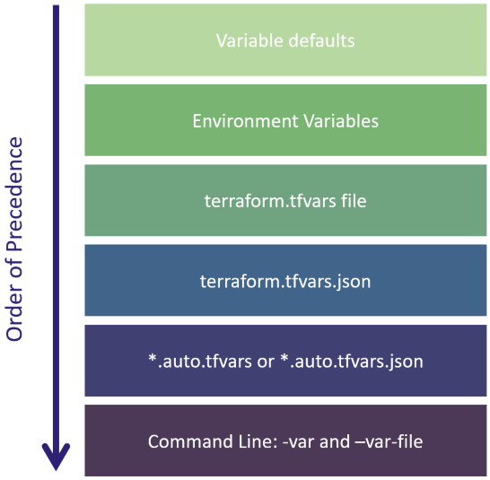

# Terraform Variables Block

Input variables (commonly referenced as just ‘variables’) are often declared in a separate file called variables.tf

> Template
```
variable "<VARIABLE_NAME>" {
    #Blockbody
    type        = <VARIABLE_TYPE>
    description = <DESCRIPTION>
    default     = <EXPRESSION>
    sensitive   = <BOOLEAN>
    validation  = <RULES>
}
```
> Terraform Input Variables - Order of Precedence
