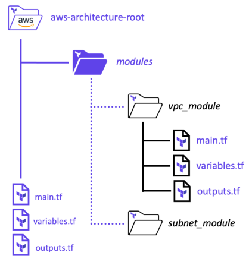

# Terraform Modules Block

> Terraform module structure



> Template
```
module "<MODULE_NAME>" {
    #Blockbody
    source          = <MODULE_SOURCE>
    <INPUT_NAME>    = <DESCRIPTION>     #Inputs
    <INPUT_NAME>    = <DESCRIPTION>     #Inputs
}
```
> Example
```
module "website_s3_bucket" {
    source="./modules/aws-s3-static-website-bucket"
    bucket_name=var.s3_bucket_name
    aws_region="us-east-1"

    tags= {
        Terraform="true"
        Environment="certification"
    }
}
```
> Create a new module block to call a remote module
```
module "subnet_addrs" {
    source          = "hashicorp/subnets/cidr"
    version         = "1.0.0"
    base_cidr_block = "10.0.0.0/22"
    networks = [
        {
        name        = "module_network_a"
        new_bits    = 2
        },
        {
        name        = "module_network_b"
        new_bits    = 2
        },
    ]
}
output "subnet_addrs" {
    value = module.subnet_addrs.network_cidr_blocks
}
```
> Download the referenced module
```
terraform init
```
> Apply new configuration
```
terraform apply -auto-approve
```
